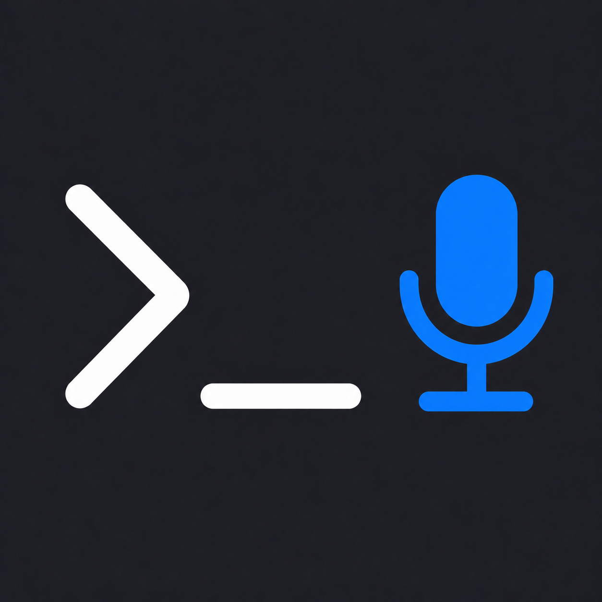
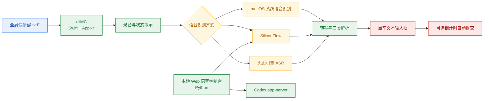

<div align="center">



# cliMC

**按住快捷键说话，把转写结果直接送进 macOS 当前输入框。**

适合在 Codex CLI、终端和其他文本输入场景中使用。

[](https://www.apple.com.cn/macos/)
[](https://www.swift.org/)
[](https://www.python.org/)
[](LICENSE)

[快速开始](#快速开始) · [使用方法](#使用方法) · [MIT 许可证](LICENSE)

</div>

## 为什么使用 cliMC

- 按住全局快捷键即可录音，松开后结束，不用切换窗口。
- 可选 macOS 系统语音识别、SiliconFlow 或火山引擎 ASR，分别支持本机实时、云端整段识别和云端实时转写。
- 转写内容会写入当前输入框；需要时可开启 1–60 秒倒计时自动提交。
- 支持自定义快捷键、口令映射、别名和火山引擎热词管理。
- 自动提交后显示两枚 Unicode Emoji 或颜文字，不下载外部表情资源。
- 本地统计语音次数、生成字数和自动提交次数，不保存转写文本或音频。

## 快速开始

### 环境要求

- macOS 14 或更高版本
- Xcode Command Line Tools（用于 Swift 构建）
- 麦克风
- Codex CLI 或其他需要语音输入的终端工具

在仓库根目录运行：

```bash
./macos-voice/scripts/install.sh
```

脚本会构建 Release 版本，将 `cliMC.app` 安装到 `~/Applications`，启动菜单栏助手，并注册登录后自动启动。

首次运行时，请在“系统设置 → 隐私与安全性”中为 cliMC 开启：

- 麦克风
- 输入监控
- 辅助功能
- 语音识别（仅使用系统语音识别时需要）

## 使用方法

1. 将光标放到终端或其他文本输入框。
2. 按住默认快捷键 `⌥E` 说话，松开后结束录音。
3. cliMC 会把识别结果写入当前输入框。自动提交默认关闭，可在设置中开启。

菜单栏中的 cliMC 图标可以打开设置和使用统计，也可以退出助手。设置页支持更换快捷键、切换识别服务、配置自动提交、维护口令映射，以及选择提交反馈样式。配置保存在 `~/.config/codex-voice/settings.json`。

录音时不要同时手动修改当前输入框，避免实时转写覆盖刚输入的内容。

## 工作原理



Swift 菜单栏应用是日常使用入口。仓库还保留了一套 Python 本地 Web 控制台，可在浏览器中录音、预览识别结果，再将确认后的命令交给 Codex。

## 语音识别方式

| 方式 | 特点 | 配置 |
| --- | --- | --- |
| macOS 系统语音识别 | 实时显示，无需 API Key；准确率相对较低 | 开启系统语音识别权限 |
| SiliconFlow | 松开快捷键后上传整段录音，非实时 | 在 cliMC 设置中填写 API Key |
| 火山引擎 ASR | WebSocket 实时转写 | 在 cliMC 设置中填写新版 API Key |

## 本地 Web 语音控制台

这部分是可选功能，与 Swift 菜单栏应用分开运行。它只监听 `127.0.0.1`，运行时不需要安装项目级 Python 依赖；语音转写需要 SiliconFlow API Key 和 `ffmpeg`。

```bash
brew install ffmpeg
cp .env.example .env
```

编辑 `.env` 并填入 API Key。程序不会自动读取这个文件，启动前需要将变量导入当前 Shell：

```bash
source .env
python3 -m app.main
```

启动后访问 `http://127.0.0.1:8787`。端口被占用时，可以通过 `PORT` 临时修改：

```bash
PORT=8790 python3 -m app.main
```

### 环境变量

| 变量 | 必填 | 用途 |
| --- | --- | --- |
| `SILICONFLOW_API_KEY` | 是 | 调用 SiliconFlow 语音识别 |
| `SILICONFLOW_BASE_URL` | 否 | 覆盖默认 API 地址 |
| `SILICONFLOW_ASR_MODEL` | 否 | 覆盖默认语音识别模型 |
| `CODEX_CWD` | 否 | 指定 Codex 的工作目录；默认使用启动目录 |
| `CODEX_BIN` | 否 | 指定 Codex 可执行文件；默认使用 `codex` |

不要把真实密钥提交到仓库。

### 本地 API

| 方法 | 路径 | 用途 |
| --- | --- | --- |
| `GET` | `/api/approvals` | 获取等待处理的 Codex 审批请求 |
| `POST` | `/api/preview` | 解析文本并返回命令预览，不执行操作 |
| `POST` | `/api/execute` | 将确认后的命令或普通提示词交给 Codex |
| `POST` | `/api/approval` | 允许或拒绝指定审批请求 |
| `POST` | `/api/transcribe` | 上传录音，返回转写文本和命令预览 |

## 项目结构

```text
.
├── app/                       # Python 本地 Web 语音控制台
│   ├── static/                # 浏览器页面
│   └── server.py              # 本地 HTTP 服务与 API
├── macos-voice/               # Swift 菜单栏应用
│   ├── Sources/               # 应用源码
│   ├── Tests/                 # Swift 与辅助脚本测试
│   ├── app/                   # App 元数据与图标
│   └── scripts/               # 安装和本地管理脚本
├── tests/                     # Python 测试
├── .env.example               # Web 控制台环境变量示例
└── LICENSE                    # MIT 许可证
```

## 技术栈

| 模块 | 技术 |
| --- | --- |
| macOS 菜单栏应用 | Swift 6、AppKit、Swift Package Manager |
| 系统录音与输入 | AVFoundation、Speech、CoreGraphics、Accessibility |
| 本地 Web 控制台 | Python 3 标准库、HTML、JavaScript |
| 远程语音识别 | SiliconFlow HTTP API、火山引擎 WebSocket ASR |

## 参与贡献

提交改动前，请先从 `master` 创建分支，并确保 Swift 与 Python 测试通过：

```bash
cd macos-voice
swift test

cd ..
PYTHONPATH=. pytest -q
```

提交 Pull Request 时，请写清楚使用场景、改动内容和验证方式。涉及界面或交互的改动，建议附上截图或录屏；发现问题也可以直接提交 Issue。

## 许可证

本项目使用 [MIT License](LICENSE)。
